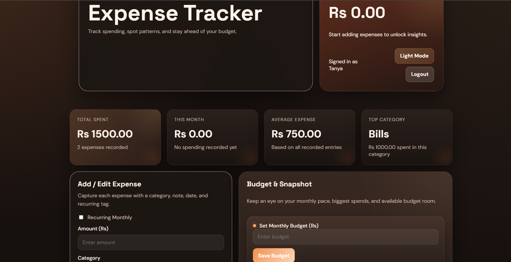
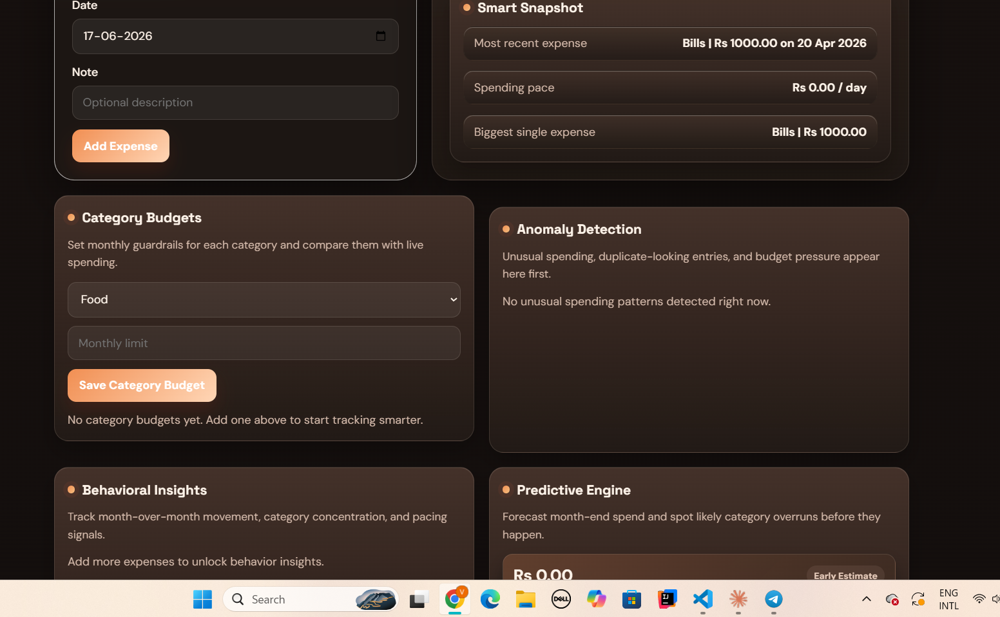
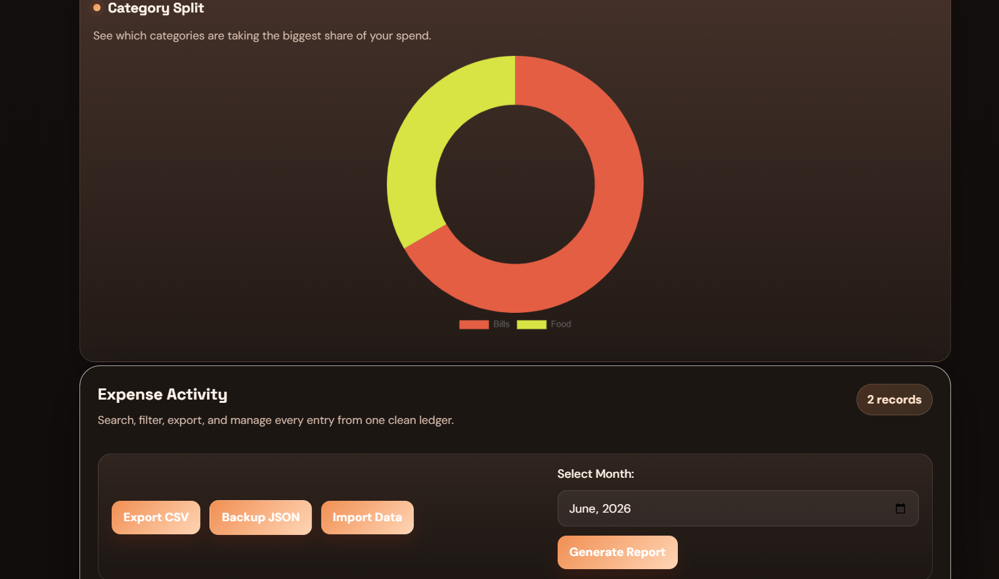
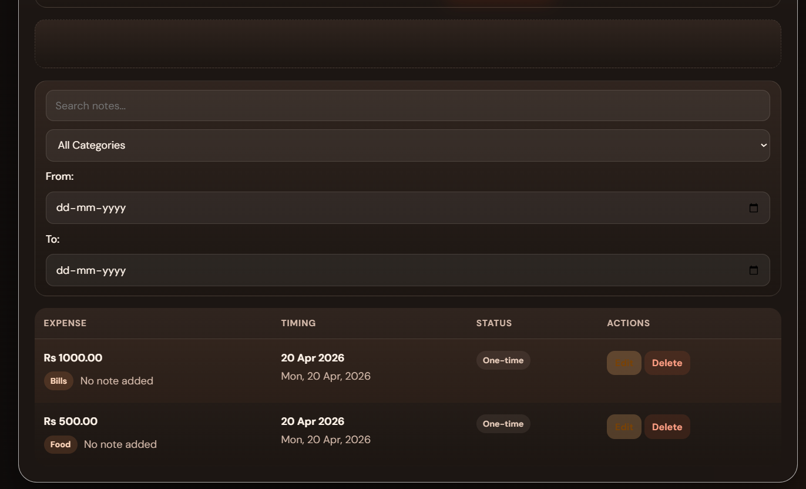

# Expense Tracker – Full-Stack Web Application

🔗 **Live Demo:** https://expense-tracker-p28d.onrender.com

A full-stack expense management system with **user authentication, anomaly detection, behavioral insights, and spending forecasts** — built with Node.js, Express, MongoDB Atlas, and Vanilla JavaScript.

---

## ✨ Features

### 🔐 Authentication
- Secure signup and login with **PBKDF2-SHA512 password hashing** (salted, 10,000 iterations)
- Stateful Bearer token sessions — stored in MongoDB, instantly revocable on logout
- Multi-user data isolation — users can only access their own expenses

### 📊 Smart Analytics (Backend-Computed)
- **Anomaly Detection** — flags spending spikes (1.75x rolling average), duplicate entries, and budget breaches
- **Behavioral Insights** — month-over-month trend analysis, top category detection, weekend spending patterns
- **Spending Forecast** — daily run rate projection to predict month-end totals per category

### 💸 Expense Management
- Add, edit, delete expenses with category, date, and notes
- Recurring expense support
- Category-wise budget limits with real-time breach warnings
- Date-range, category, and keyword filtering
- CSV export with proper escaping

### 🎨 Frontend
- Clean, responsive UI with dark/light theme (respects system preference)
- Dynamic Chart.js doughnut chart for category-wise spending
- XSS-protected rendering via `escapeHtml()` on all user content
- Session restoration on page refresh — no re-login needed

---

## 🛠️ Tech Stack

| Layer | Technology |
|---|---|
| Frontend | HTML, CSS, Vanilla JavaScript, Chart.js |
| Backend | Node.js, Express.js v5 |
| Database | MongoDB Atlas (Mongoose ODM) |
| Auth | PBKDF2 password hashing, Bearer token sessions |
| Hosting | Render (backend + frontend) |

---

## 📁 Project Structure

```
expense-tracker/
├── expense-backend/
│   ├── server.js          # Express app — routes, middleware, analytics engine
│   ├── .env.example       # Environment variable template
│   └── package.json
├── expense-frontend/
│   ├── index.html         # App shell
│   ├── script.js          # All frontend logic — auth, API calls, rendering
│   └── style.css          # Responsive styles + dark/light theme
└── README.md
```

---

## 🚀 Getting Started

### Prerequisites
- Node.js v18+
- A MongoDB Atlas account (free tier works)

### 1. Clone the repository
```bash
git clone https://github.com/Vartika-Mishra13/expense-tracker.git
cd expense-tracker
```

### 2. Set up the backend
```bash
cd expense-backend
npm install
```

Create a `.env` file based on `.env.example`:
```env
MONGO_URI=mongodb+srv://<username>:<password>@<cluster>.mongodb.net/expense-tracker
PORT=3001
FRONTEND_URL=http://localhost:5500
```

Start the server:
```bash
npm start
```

### 3. Run the frontend

Open `expense-frontend/index.html` in a browser, or use Live Server (VS Code extension) on port 5500.

> Make sure `API_URL` in `script.js` points to `http://localhost:3001` for local development.

---

## 🔌 API Reference

### Auth Endpoints (Public)

| Method | Endpoint | Body | Description |
|---|---|---|---|
| POST | `/auth/signup` | `{ name, email, password }` | Register new user |
| POST | `/auth/login` | `{ email, password }` | Login, returns Bearer token |

### Protected Endpoints (Require `Authorization: Bearer <token>`)

| Method | Endpoint | Description |
|---|---|---|
| GET | `/auth/me` | Get current user (session restore) |
| POST | `/auth/logout` | Invalidate current token |
| GET | `/expenses` | Get all expenses for logged-in user |
| POST | `/expenses` | Create new expense |
| PUT | `/expenses/:id` | Update expense (user-scoped) |
| DELETE | `/expenses/:id` | Delete expense (user-scoped) |
| GET | `/category-budgets` | Get all category budgets |
| PUT | `/category-budgets/:category` | Set/update category budget |
| GET | `/anomalies` | Get spending anomalies |
| GET | `/insights` | Get behavioral insights |
| GET | `/forecast` | Get month-end spending forecast |
| GET | `/health` | Health check |

---

## 🗄️ Database Schema

### Users
```
{ id, name, email (unique), passwordHash, passwordSalt, tokens: [] }
```

### Expenses
```
{ id, userId (indexed), amount, category, date, note, recurring }
```

### CategoryBudgets
```
{ userId, category, monthlyLimit }
// Unique compound index: { userId, category }
```

---

## 📸 Screenshots

### Dashboard + Anomaly Detection



### Expense Table + Filters


---

## 📬 Contact

Vartika Mishra — vartikam032@gmail.com  
GitHub: [Vartika-Mishra13](https://github.com/Vartika-Mishra13)